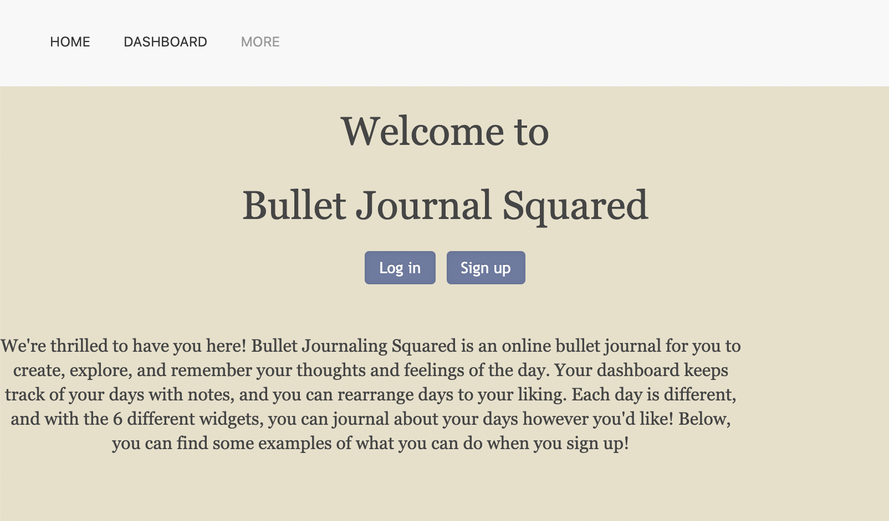
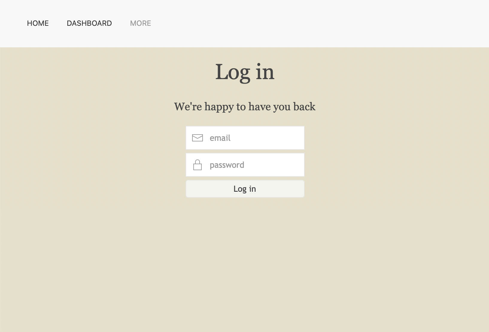
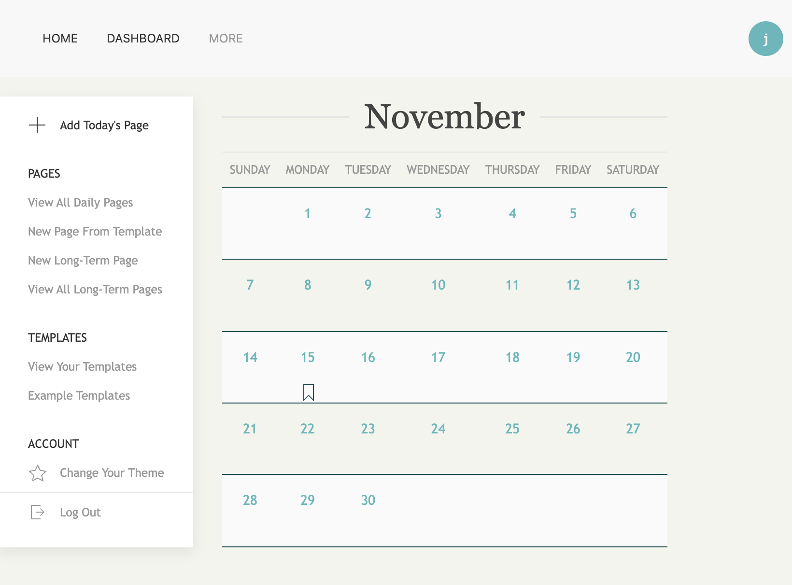
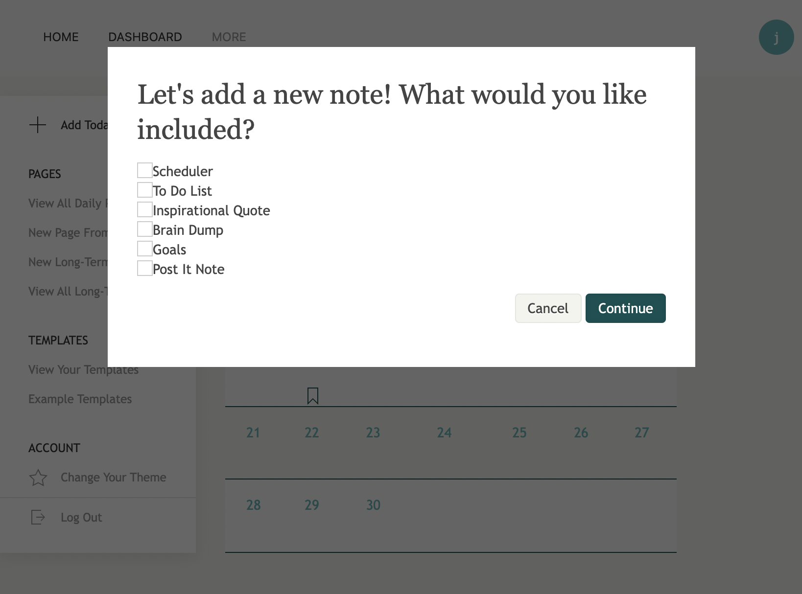
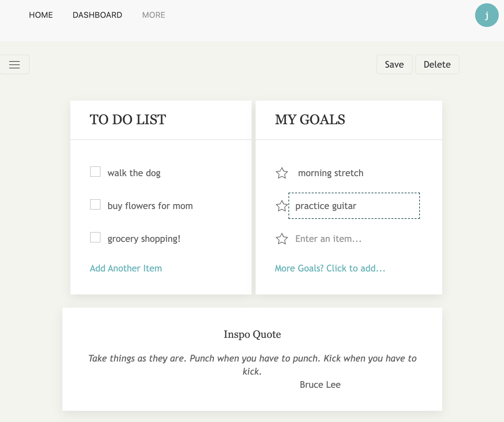
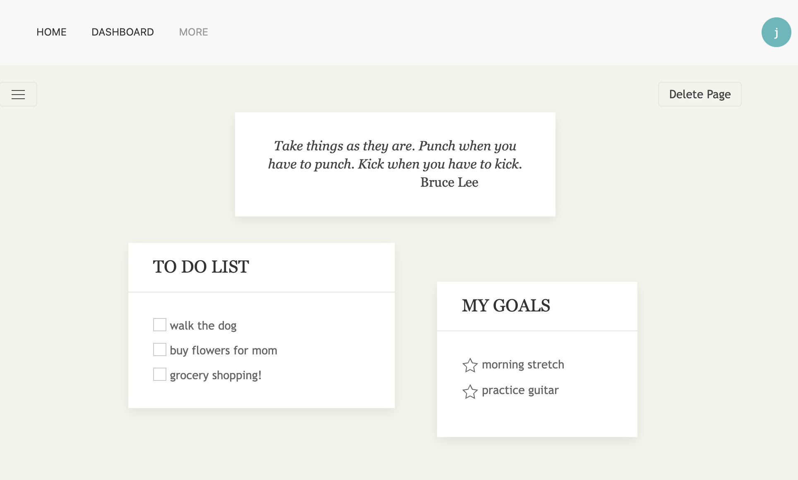

# Bullet Journal Squared 
## About
Bullet Journal Squared is a website that allows users to create an account, write journal entries, and view their past thoughts and feelings. 

Deployed Link: https://bullet-journal-squared.herokuapp.com/

## Table of Contents
* [Description](#description)
* [Installation](#installation)
* [Deployment](#deployment)
* [Contributing](#contributing)
* [Questions](#questions)

## Description
On this website, users create journal entries for the current day, view past days journal entries, and personalize them as they please. Upon website load, they are met with the home page:

When they choose to login, they are then redirected to the login page:

From there, the user is taken to their dashboard and presented with multiple options:
- To view daily pages
- To create a new page for the day
- To create a new long-term page
- To view the long-term pages
- To view example templates
- To change the theme
- To log out

When the user has decided to create a new page for the day, they are shown a modal, asking which widgets that they'd like for that day. 

With the exception of inspirational quotes, which are randomly generated, the rest are editable and the user enters in their content for the day.

Once created, the user is sent back to the dashboard, where they can see on their calendar, that they have a bookmark icon on the days where they have a note. When they click on the note, they are taken to an interactive journal entry, where they can arrange the widgets as they please and check off any todos that they have accomplished.

They are also able to delete pages if they decide that they don't want them anymore, or if they want to go back and edit the current page, they can do that as well. 

## Installation
Run `npm i` to install `bcrypt`, `cloudinary`, `connect-session-sequelize`, `dotenv`, `express`, `express-handlebars`, `express-session`, `mysql2`, `jquery` and `sequelize`.

## Deployment
Live site is available [here](https://bullet-journal-squared.herokuapp.com/).

## Contributing
### Lindsay Fitzgerald - Project Manager 
    - https://github.com/lindsfitz
### Mark Lohse-Miranda - Git Coordinator
    - https://github.com/Mark-LohseMiranda
### Kellie Kumasaka - Front-End Developer
    - https://github.com/kelliekumasaka
### Kenneth Felix - Back-End Engineer
    - https://github.com/axumdzn

## Questions
Here is a link to our [GitHub repository](https://github.com/Mark-LohseMiranda/bulletjournal) and if you have any additional questions, please visit our GitHub profiles for contact information.
